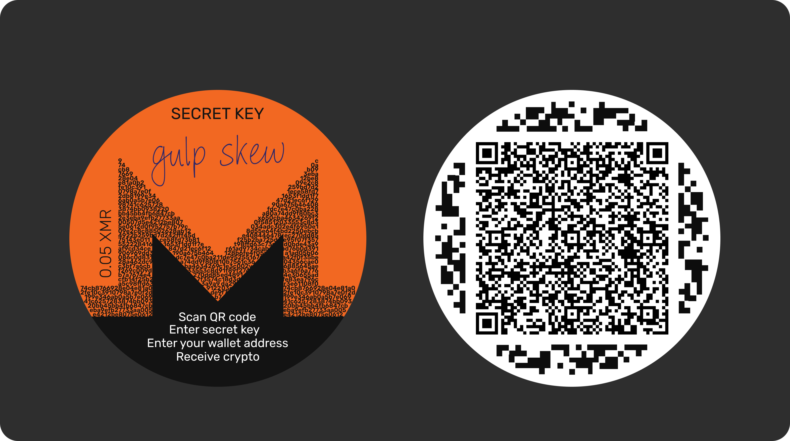

### tip-monero-ts
- Create a wallet
- Open an existing wallet via QR code
- Sweep full balance to a specified address
### Network

By default, the project is configured to work on **Stagenet** using a public node.  
You can find or change the network settings in [`config/config`](config/config).

### Usage Notes

⚠️ If you sweep funds from the testing wallet, please be respectful and return the balance afterward.

### Installation

```bash
git clone https://github.com/monceex/tip-monero-ts.git
```
```bash
cd tip-monero-ts
```
```bash
pnpm install
```
```bash
pnpm run dev
```

Go to ```http://localhost:5173``` in your browser.

 1. Create a wallet
 2. Copy the generated wallet address.
 3. Click on the link: [\[link\]](http://localhost:5173?n=Paper%20Wallet&h=1823796&m=U2FsdGVkX18Vut85CHPu%2bdyB3ME5ZQwvno/t/PbICc0Mjqi6kb/VNaPGUYh5iMGBlaIZOfeYp8K7DZbPC4KuBeRZGx5nUELGdlCyICslk9S0Fmup33gKRVnkyf4Xs4N9CdjbNn/pGTgUQE2peH/fHv25mUF4v/NHLPYT7JkyME6kqb4YKCRxhAxJgzhl3h9GEVupcNyK2piGmpZhncyfA7OhNYOW71%2bhGC%2bG2AcZWQHpdeAaVNFzF9ORypLulePM) or scan the QR code with your phone.
 
 4. Enter secretkey ```gulp skew```  and sweep balance

> Note for mobile testing on local network If you're opening the app on
> your phone connected to the same network, localhost won’t work
> on your phone.
> 
> You’ll need to replace localhost in the URL with your computer's local
> IP address. For example: http://192.168.0.42:5173
> 
> You can find your IP address via:
> 
> macOS / Linux: ```ifconfig``` or ```ip a``` Windows: ```ipconfig```


### Future Plans

  

- [ ] Wipe this shit

- [ ] Rewrite with fewer regrets

